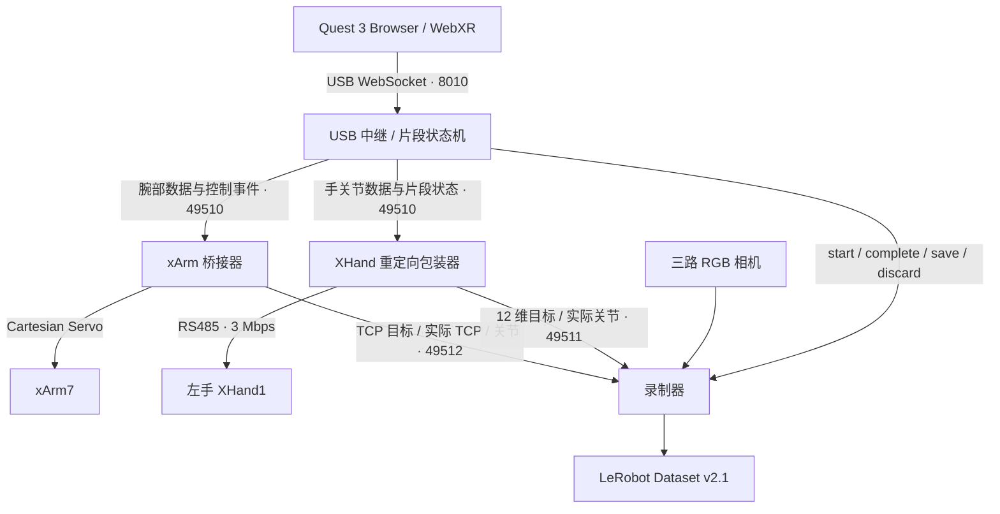

# Quest 3 · xArm7 · XHand1 Teleoperation & Capture

使用 **Meta Quest 3 左手追踪**同时遥操 **xArm7 + 左手 XHand1**，采集三路 RGB 和机器人目标/反馈，直接保存为 **LeRobot Dataset v2.1**。

统一入口管理四个进程：Quest USB 中继、XHand 厂商重定向包装器、xArm 桥接器和录制器。控制、片段确认、归位和故障退出都由同一条启动流程协调。

> 当前实现面向 Ubuntu/Linux x86_64、Python 3.10、左手 XHand1 和 RS485。RobotEra 软件与设备授权、LeRobot v2.1 源码由部署方另行提供。

## 链路



机械臂使用左腕相对位姿控制 TCP，起始腕姿与当前 TCP 配对；手部使用 RobotEra 重定向生成 12 维关节目标。机械臂连接后即发送空闲心跳，腕部预览和重定向预热在片段开始前完成。

详细端口、心跳及数据流见 [链路说明](docs/QUEST3_TELEOP_CHAIN.md)。

## 功能

- 一个命令启动、监控和清理四个进程。
- 通过 ADB USB 访问 Quest Browser，接收 WebXR 手部数据。
- 头显音量键控制校准、开始、结束、保存及丢弃。
- 臂和手按配置归位，等待归位和录制器均就绪后开始下一条。
- xArm 有限值、单步限幅、TCP 边界和实际姿态误差检查。
- XHand 预热、片段放行、心跳检查和断联暂停。
- 三路相机：`head_view`、`front_left_view`、`wrist_view`，支持 RealSense 和 UVC。
- LeRobot Dataset v2.1 输出及 NPZ 备用格式。
- YAML 部署配置、只读预检、日志及代码打包工具。

## 依赖与运行环境

| 组件 | 环境 | 依赖 |
|---|---|---|
| 启动器、机械臂、预检 | `xarm7-xhand1-deploy` | `environment.yml` 固定版本依赖 |
| Quest 页面、中继、XHand | RobotEra 厂商环境 | `xhand_tele_ops`、`webxr`、`retargetx`、配套原生库和设备授权 |
| v2.1 录制器 | 厂商环境 | 已兼容的数据集依赖及 LeRobot v2.1 源码 |

启动器在厂商子进程中完整激活其 Conda 环境；机械臂进程使用控制环境。

LeRobot 源码必须满足 `lerobot.datasets.lerobot_dataset.CODEBASE_VERSION == "v2.1"`。启动器会核对格式版本，录制器包含现有厂商 PyAV 环境的 H.264 兼容处理。包版本号与 Dataset 格式版本是两个不同的检查项。

## 安装

```bash
git clone https://github.com/summer-lotso/quest3-xarm7-xhand1-capture.git
cd quest3-xarm7-xhand1-capture
conda env create -f environment.yml
conda activate xarm7-xhand1-deploy
python -m pip install -e . --no-deps
```

按 RobotEra 交付说明安装厂商 Python 3.10 环境及设备授权。准备经过验证的 LeRobot v2.1 源码树，在 runtime 配置中填写其 `src` 路径。

控制环境若需要直接诊断 XHand，另外安装匹配 Python 3.10 的 `xhand_controller` 厂商 wheel；遥操手部命令通过厂商环境里的 `XHandTeleOps` 执行。

## 部署配置

```bash
cp configs/hardware.example.yaml configs/hardware.local.yaml
cp configs/runtime.example.yaml configs/runtime.local.yaml
```

编辑两份本机配置：

- `hardware.local.yaml`：机械臂 IP、实测 home、TCP 偏移、手部可达 home、串口及相机设备。
- `runtime.local.yaml`：厂商目录、厂商 Python、LeRobot 源码路径、任务描述、数据输出目录及控制参数。

YAML 相对路径以配置文件所在目录为基准，支持 `~`；命令行参数可覆盖配置值。运动许可只接受显式命令行参数。

将 `configs/vendor_usb.example.yaml` 复制到已授权厂商目录作为 `config_meta_quest_usb.yaml`，核对串口和授权文件的位置。`meta_quest.start_web` 保持 `false`，HTTPS 服务由本工程中继提供。

完整配置步骤见 [快速启动说明](docs/QUICKSTART.md)。

## 启动遥操和数采

先执行只读预检：

```bash
conda activate xarm7-xhand1-deploy
python scripts/start_quest3_capture.py \
  --runtime-config configs/runtime.local.yaml --check-only
```

确认工作区、起始姿态和现场急停后启动：

```bash
python scripts/start_quest3_capture.py \
  --runtime-config configs/runtime.local.yaml \
  --execute --confirm I_HAVE_CLEARED_THE_WORKSPACE
```

启动器检查设备、配置、磁盘、端口和机械臂状态，等待四个进程就绪后打印 `CAPTURE_STACK_READY`。Quest 通过 USB 连接并允许 ADB，Browser 打开 `https://localhost:8010`，接受本地证书并进入 AR。

| 操作 | 行为 |
|---|---|
| 空闲时音量 **+** | 左手静止校准约 3 秒，开始跟随和录制 |
| 录制时音量 **−** | 停止本条，等待确认 |
| 待确认时音量 **+** | 保存本条并让臂、手归位 |
| 待确认时音量 **−** | 丢弃本条并归位 |
| 电脑 `Ctrl+C` | 停止控制进程并清理采集流程 |

归位及录制器都就绪后才能开始下一条。`--no-wear` 是固定在支架上的 Quest 的可选模式，会在退出时恢复 proximity 设置；默认按正常佩戴运行。

## 数据格式

默认软件采样 **20 Hz**，相机配置 **30 FPS、640×480 RGB**。采集器取各路新鲜数据，文件时间轴按 `frame_index / fps` 生成；各设备未使用硬件触发同步。

| 字段 | 维度 | 单位 / 含义 |
|---|---|---|
| `action` | **18** | TCP 目标 6 维（mm / rad）+ 手关节目标 12 维（rad） |
| `observation.arm_joint_position` | 7 | 机械臂实际关节，rad |
| `observation.arm_tcp_pose` | 6 | 实际 TCP，mm / rad |
| `observation.hand_joint_position` | 12 | 手实际关节，rad |
| `observation.images.<view>` | RGB 视频 | head / front-left / wrist 三个视角 |

```text
dataset/
├── meta/
│   ├── info.json                 # codebase_version: v2.1
│   ├── tasks.jsonl
│   ├── episodes.jsonl
│   └── episodes_stats.jsonl
├── data/chunk-000/episode_000000.parquet
└── videos/chunk-000/observation.images.<view>/episode_000000.mp4
```

同一 v2.1 数据目录可以续采，启动时核对 FPS 和字段。`--format npz` 提供备用保存方式，需使用独立输出目录。

## 参数和故障定位

runtime 模板的默认机械臂参数：平移缩放 `0.6`、相对范围 `300 mm / 2.0 rad`、每帧各平移分量 `1.0 mm`、各 RPY 分量 `0.015 rad`；桥接约 `30 Hz`。这些参数同时受到 hardware 配置中的单步限制和控制器 TCP 安全边界约束，应按现场工作区设置。

日志保存在 `logs/quest3_capture_*.log`，每行标记 `relay`、`xhand`、`xarm` 或 `recorder`。`CHECK ARM` 查看桥接器心跳或控制器故障；`CHECK TRACKING` 查看 Quest AR 与左手追踪；XHand 首次重定向需要完成编译预热。

机械臂可以单独检查：

```bash
python scripts/check_arm_ready.py --config configs/hardware.local.yaml
```

`reduced_mode_enabled` 与 `safety_boundary_enabled` 在报告中分别显示。`state=4`、无错误且静止时表示可恢复的软件停止；检查命令本身不发送运动命令。

## 工程结构、测试和打包

```text
configs/                 配置模板
scripts/                 统一入口、四个进程、诊断及打包工具
src/xarm7_xhand1/         机器人适配、相机、坐标映射、保存和配置
tests/                  无实机回归检查
docs/                   部署说明与链路图
vendor/README.md        厂商依赖说明
```

```bash
python -m pytest -q
python scripts/package_capture.py
```

打包工具生成源码 ZIP 和 SHA256 清单。回归检查覆盖状态流程、配置路径、跟踪误差、保存/丢弃和进程边界；实机部署还依赖具体 SDK、硬件配置与现场状态。

## 授权与仓库内容

本仓库仅包含应用源码、测试、文档和配置模板。RobotEra wheel、`auth_info.json`、`key.dat`、本机 `.local.yaml`、日志及采集数据不包含在仓库或交付源码包中；配置模板只引用授权文件名。

厂商 SDK 和 LeRobot 等第三方组件分别遵守其原有授权条款。项目源码的再分发许可尚未另行声明。
