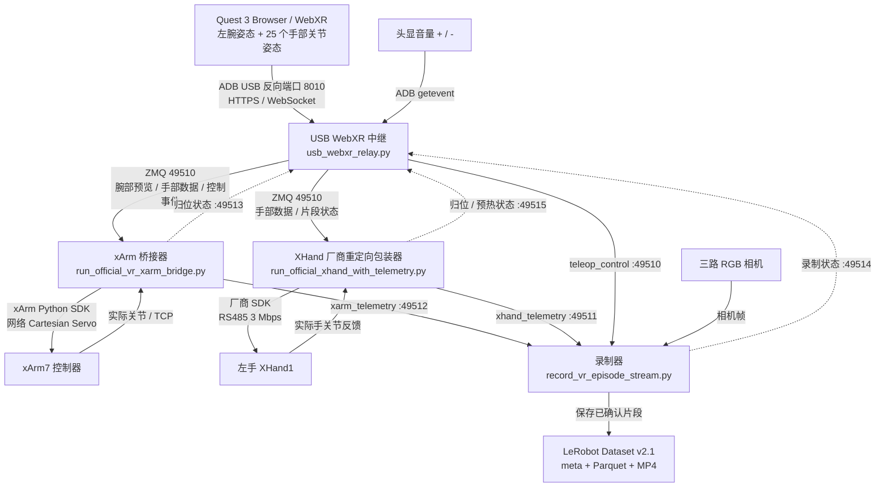

# Meta Quest 3 → xArm7 + 左手 XHand1 遥操数采链路

按 2026-10-08 的本地代码整理。工程路径为 `~/projects/quest3-xarm7-xhand1-capture`。

统一入口 `scripts/start_quest3_capture.py` 管理 USB 中继、XHand 接收器、录制器和 xArm 桥接器四个进程。它执行设备预检、按顺序等待进程就绪、保存日志，并在关键进程失败时清理整套流程。



## 运行环境与进程

| 进程 | 环境 | 职责 |
|---|---|---|
| 统一启动器 | `xarm7-xhand1-deploy` | 预检、启动、监控、退出清理 |
| USB WebXR 中继 | `xhand_tele_env_310` | WebXR 数据转换、音量键、片段状态机、开始条件检查 |
| XHand 包装器 | `xhand_tele_env_310` | 厂商重定向预热、手部命令、手部反馈、归位 |
| xArm 桥接器 | `xarm7-xhand1-deploy` | 左腕相对位姿映射、限幅、Cartesian Servo、机械臂反馈、归位 |
| LeRobot v2.1 录制器 | `xhand_tele_env_310` | 遥测与相机采样、片段缓冲、确认保存 |

启动器在厂商子进程里完整激活 Conda 环境。录制器通过 `PYTHONPATH` 使用 `~/projects/lerobot-v21/src` 的本地 LeRobot 源码；启动前检查 `CODEBASE_VERSION == "v2.1"`。

## 数据流与控制流

Quest Browser 打开 `https://localhost:8010` 并进入 AR。`adb reverse tcp:8010 tcp:8010` 将头显的 localhost 端口接到电脑；数据通过 USB 上的 WebSocket 传输。中继将每只手的 25 个 WebXR 4×4 关节矩阵转换为位置和 XYZW 四元数。当前组合使用左手。

xArm 通道取左腕相对于本条零点的平移和旋转，映射到机械臂基座坐标：WebXR 前/左/上对应机器人 +X/+Y/+Z。开始片段时把当时左腕与当前 TCP 配对。桥接器下发 6 维 TCP 目标 `[x,y,z,roll,pitch,yaw]`，由 xArm 控制器执行 Cartesian Servo；同时读取 7 个关节与实际 TCP。

XHand 通道把整只左手数据交给 RobotEra `retarget_data_meta_quest`，生成 12 个手关节目标，再通过 RS485 下发。首次重定向会编译厂商内核，因此在进入片段前预热，并报告 `retarget_warm`。预热时计算目标，正式跟随由片段 armed 状态放行。

中继在空闲时提供 `arm_preview`，xArm 桥接器连接后即持续发送空闲遥测心跳。这样机械臂就绪检查可以在按音量 + 前完成。`relay_status` 以约 10 Hz 镜像 `armed`、片段编号、归位和待确认状态；控制事件用于推动状态切换。

| 端口 | 发布方 → 订阅方 | 主要内容 |
|---|---|---|
| 8010 | Quest Browser ↔ USB 中继 | HTTPS 页面、WebSocket 手部数据及界面提示 |
| 49510 | 中继 → xArm / XHand / 录制器 | `arm_preview`、`hand_data`、`teleop_control`、`relay_status` |
| 49511 | XHand → 录制器 | 12 维目标与实际关节反馈 |
| 49512 | xArm → 录制器 / 中继 | TCP 目标、实际 TCP、7 维实际关节、运动状态 |
| 49513 | xArm → 中继 | 机械臂归位进度、就绪、故障 |
| 49514 | 录制器 → 中继 | idle / recording / pending / fault、帧数、链路状态 |
| 49515 | XHand → 中继 | 手部归位、预热及链路状态 |

## 一条片段的流程

1. 预检设备、串口、相机、TCP 配置和安全边界；XHand 归位，录制器就绪，机械臂发送心跳。
2. Quest 左手追踪有效，XHand 重定向预热完成后，音量 + 请求开始。
3. 左手保持平稳约 3 秒；校准完成后发布 `start`，机械臂和手开始跟随，录制器进入 recording。
4. 音量 - 发布 `complete`，停止跟随，片段进入 pending，等待保存或丢弃。
5. 音量 + 发布 `save`，写出数据；音量 - 发布 `discard`，清理本条缓冲。两种选择都会请求臂和手回配置的 home。
6. 臂、手及录制器都报告就绪后，才允许下一条。

追踪、心跳、设备或录制故障会停止本条；开始条件会具体指出机械臂、手、录制器或追踪哪一项尚未就绪。启动器遇到关键进程故障会结束整套进程。相关输出保存在 `logs/quest3_capture_*.log`。

## 保存的数据

采集器默认按 **20 Hz** 取最新机械臂/手遥测和相机帧；相机配置为 **30 FPS、640×480 RGB**。这是按新鲜度约束进行的软件采样，流之间没有硬件触发同步。遥测默认新鲜度窗口为 0.25 秒；LeRobot 文件中的时间轴按 `frame_index / fps` 生成。

| 字段 | 维度 / 类型 | 含义与单位 |
|---|---|---|
| `action` | 18 个 float32 | xArm TCP 目标 6 维（前三维 mm、后三维 rad）+ XHand 目标 12 维（rad） |
| `observation.arm_joint_position` | 7 个 float32 | 机械臂实际关节位置，rad |
| `observation.arm_tcp_pose` | 6 个 float32 | 机械臂实际 TCP，mm / rad |
| `observation.hand_joint_position` | 12 个 float32 | 手的实际关节位置；厂商反馈从 degree 转为 rad |
| `observation.images.head_view` | RGB 视频 | 全局视角，RealSense |
| `observation.images.front_left_view` | RGB 视频 | 前左视角，RealSense |
| `observation.images.wrist_view` | RGB 视频 | 腕部 UVC 相机，配置旋转 180° |

`action` 总维度为 **18**。7 维机械臂关节反馈另存为 observation。确认保存后生成 v2.1 的 `meta/info.json`、`meta/tasks.jsonl`、`meta/episodes.jsonl`、`meta/episodes_stats.jsonl`、逐片段 Parquet 和三路 MP4。

## 当前默认参数和入口

以代码默认值为准：机械臂桥接约 30 Hz，XHand 循环约 60 Hz，录制约 20 Hz；平移缩放 0.6，起始位姿偏移范围 300 mm / 2.0 rad，每帧每个平移分量限幅 1.0 mm，每个 RPY 分量限幅 0.015 rad。桥接器还应用本机硬件限幅、TCP 安全边界和实际姿态跟踪误差检查。

```bash
conda activate xarm7-xhand1-deploy
cd ~/projects/quest3-xarm7-xhand1-capture
python scripts/check_arm_ready.py
python scripts/start_quest3_capture.py \
  --task "Pick up object and place it in the tray" \
  --root datasets/quest3_xarm7_xhand1_v21 \
  --repo-id local/xarm7_xhand1_quest3 \
  --execute --confirm I_HAVE_CLEARED_THE_WORKSPACE
```

本机设备、home、TCP 和相机配置：`configs/hardware.local.yaml`。厂商单手 USB 配置：`~/projects/teleop_software_pkg/config_meta_quest_usb.yaml`。

主要实现位置：`scripts/start_quest3_capture.py`、`scripts/usb_webxr_relay.py`、`scripts/run_official_vr_xarm_bridge.py`、`scripts/run_official_xhand_with_telemetry.py`、`scripts/record_vr_episode_stream.py`、`src/xarm7_xhand1/official_vr.py`、`src/xarm7_xhand1/recording.py`。
